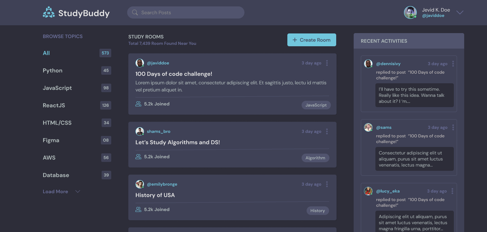

# Study Bud

Study Bud is a social media application designed to connect people who want to learn coding. This platform allows users to find study partners, join coding groups, share resources, and support each other in their learning journey.



## Features

- User registration and authentication
- Create and join study groups
- Share coding resources and materials
- Post updates and interact with other learners
- Real-time messaging with study partners

## Technologies Used

- Python
- Django
- HTML, CSS, JavaScript
- PostgreSQL (Database)

## Getting Started

Follow these instructions to set up the project locally on your machine.

### Prerequisites

- Python 3.x
- Django 3.x or higher
- PostgreSQL

### Installation

1. **Clone the repository:**

   ```bash
   git clone https://github.com/abeyasmare/Study-budd.git
   cd studybud

2. **Set up the virtual environment:**
    ```bash
      python3 -m venv venv
      source venv/bin/activate  # On Windows, use `venv\Scripts\activate`

3. **Set up the virtual environment:**
    ```bash
      python3 -m venv venv
      source venv/bin/activate  # On Windows, use `venv\Scripts\activate`


4. **Apply the migrations:**
    ```bash
        python manage.py migrate

5. **Create a superuser:**
    ```bash
        python manage.py createsuperuser --username [username] --email [email]
   
6. **Start Django development server**
   ```bash
        python manage.py runserver